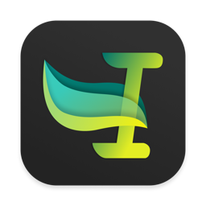
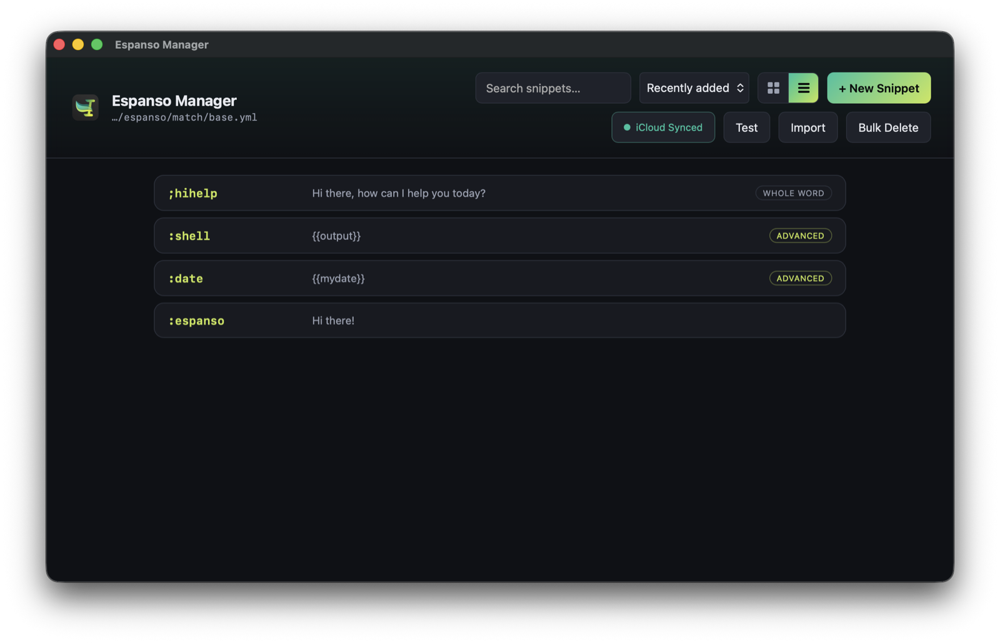

<p align="center">
  
</p>

<h1 align="center">Espanso Manager</h1>

<p align="center">
  A simple local app for managing your <a href="https://espanso.org/">Espanso</a> snippets —
  create, edit, search, and delete text expansions from a clean UI instead of hand-editing YAML.
  Optional one-click iCloud sync keeps your snippets in step across Macs.
</p>

<p align="center">
  <a href="LICENSE"></a>
  
  <a href="https://github.com/metabreakr/espanso-manager/actions/workflows/ci.yml"></a>
</p>

<p align="center">
  
</p>

---

## Why

Espanso stores snippets in a `base.yml` match file that you normally edit by hand. This app
gives you a friendly interface over that file while **preserving your comments, formatting, and
any advanced entries** — it edits the YAML surgically rather than rewriting it.

## Features

- **Create / edit / delete** snippets with a form UI, plus live search and sorting.
- **Import from CSV** (e.g. a TextExpander export) with a preview: pick exactly what to import
  (Shift/⌘-click to multi-select), with snippets that use TextExpander-only features flagged and
  existing-trigger duplicates highlighted.
- **Bulk delete** — select many snippets at once and remove them together.
- **Markdown editing + live Test preview** — a formatting toolbar for snippet text, plus a
  Test panel that renders your Markdown live so you can see how it'll look.
- **Auto-reloads Espanso** after every change, so edits take effect immediately.
- **Grid or list view**, remembered between sessions.
- **Comment-preserving** — your `# comments` and layout in `base.yml` are never clobbered.
- **Advanced entries stay safe** — snippets with variables, shell/date output, regex triggers,
  forms, etc. are shown as an editable raw-YAML block so nothing is lost or mangled.
- **One-click iCloud sync** — move your match file into iCloud Drive (with a symlink left where
  Espanso expects it) so edits sync across your Macs. Toggle on/off in-app; existing snippets
  are always backed up first, never silently overwritten.
- **Runs as a standalone app window** — a small native WebKit window (not a browser tab).
  If no Swift compiler is available at install time, it gracefully falls back to opening the
  UI in your default browser instead.
- **Local & private** — a tiny server bound to `127.0.0.1`; nothing leaves your machine.
- **Light footprint** — one runtime dependency (`yaml`); everything else is the Node standard
  library and vanilla HTML/CSS/JS.

## Requirements

- macOS (the app bundle and iCloud sync are macOS-specific)
- [Espanso](https://espanso.org/) installed
- [Node.js](https://nodejs.org/) 18+ — the installer sets this up for you via `nvm` if missing

## Install

Clone (or download) this folder somewhere you like, then double-click **`install.command`**
in Finder — or run it from a terminal:

```sh
bash install.sh
```

The installer will:

1. Find Node.js (installing it via `nvm`, no admin password, only if it's genuinely missing).
2. Install the one dependency.
3. Build **Espanso Manager.app** into `~/Applications`, built locally so there's no
   "unidentified developer" Gatekeeper prompt.

Then launch **Espanso Manager** from Launchpad, Spotlight, or your Applications folder.

> Re-running `install.command` any time is safe — it just rebuilds the app. Your snippets are
> never touched by the installer.

## iCloud sync across Macs

Click the **iCloud** button in the top bar and choose **Enable Sync**. This moves your
`base.yml` into `iCloud Drive/Espanso/` and leaves a symlink at Espanso's usual location, so
Espanso keeps working unchanged while the file syncs.

On a second Mac: let iCloud finish downloading the `Espanso` folder, run `install.command` from
it, open the app, and click **Enable Sync** — if that Mac already had its own snippets, they're
backed up first (never silently overwritten).

## Development

```sh
npm install        # install deps
npm start          # run the server at http://127.0.0.1:8934
npm test           # run the store smoke tests
```

Point the app at a different match file for testing with the `ESPANSO_MATCH_FILE` env var, or
change the port with `PORT`.

### Layout

| Path | What it is |
| --- | --- |
| `server.mjs` | Tiny HTTP server: static UI + JSON API (Node stdlib only) |
| `store.mjs` | YAML read/write, atomic saves, iCloud sync logic |
| `public/` | The front-end (vanilla HTML/CSS/JS) |
| `EspansoManagerApp.swift` | Native WebKit window wrapper (compiled at install time) |
| `install.sh` / `install.command` | Builds the macOS `.app` bundle |
| `EspansoManager.launcher.sh` | Browser-launcher fallback used when Swift isn't available |
| `store.test.mjs` | Smoke tests (`npm test`) |

## License

Licensed under the [GNU General Public License v3.0](LICENSE) — the same license as
[Espanso](https://github.com/espanso/espanso) itself.

© 2026 Jonathan Ruzek. This program is free software: you can redistribute it and/or modify it
under the terms of the GPL as published by the Free Software Foundation, version 3. It is
distributed WITHOUT ANY WARRANTY; without even the implied warranty of MERCHANTABILITY or
FITNESS FOR A PARTICULAR PURPOSE. See the [LICENSE](LICENSE) file for details.

> Note: Espanso Manager is an independent tool that reads and writes Espanso's `base.yml` file;
> it does not include or link Espanso's source code. GPL-3.0 is used here to match the upstream
> project by choice.
